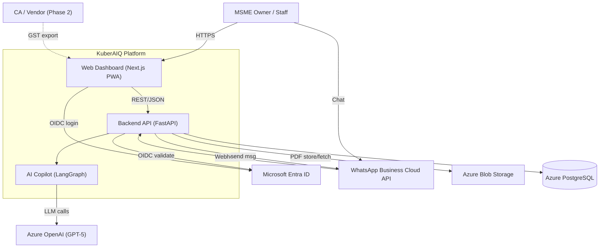
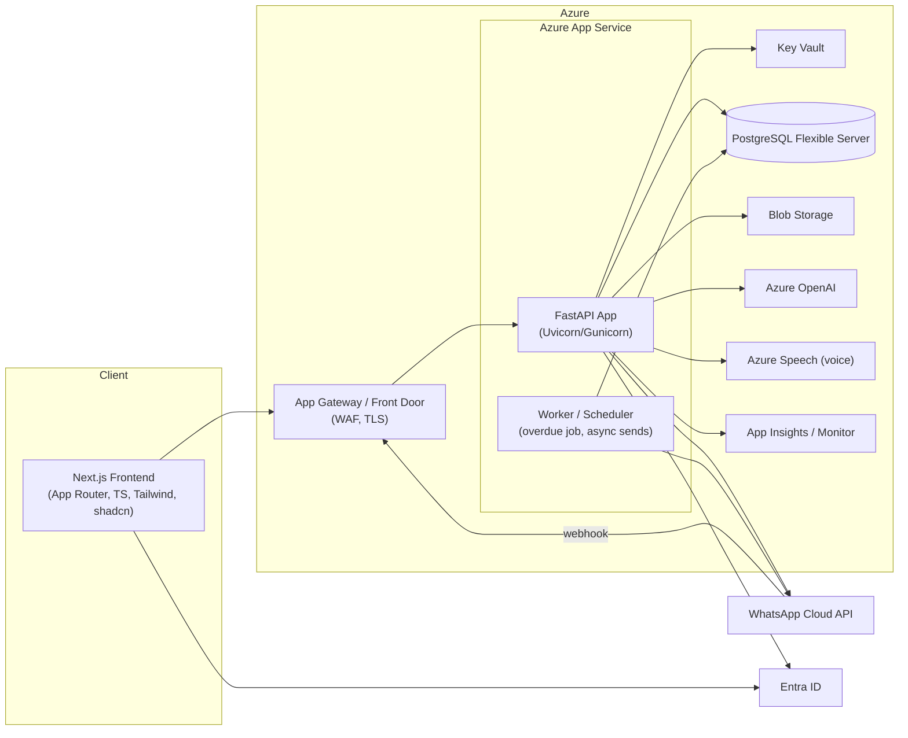
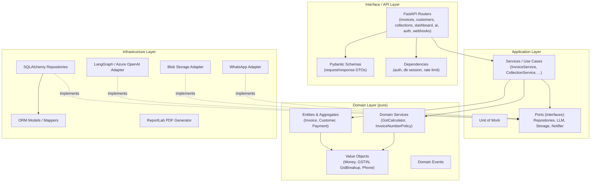
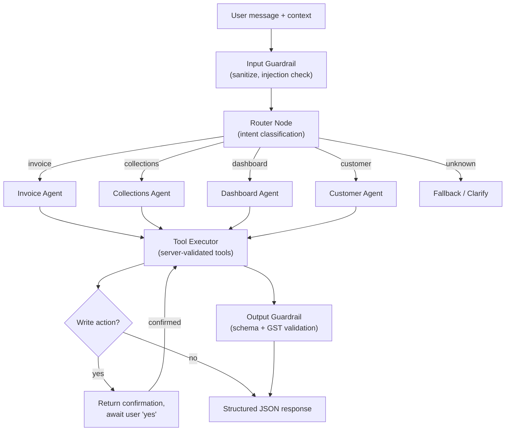
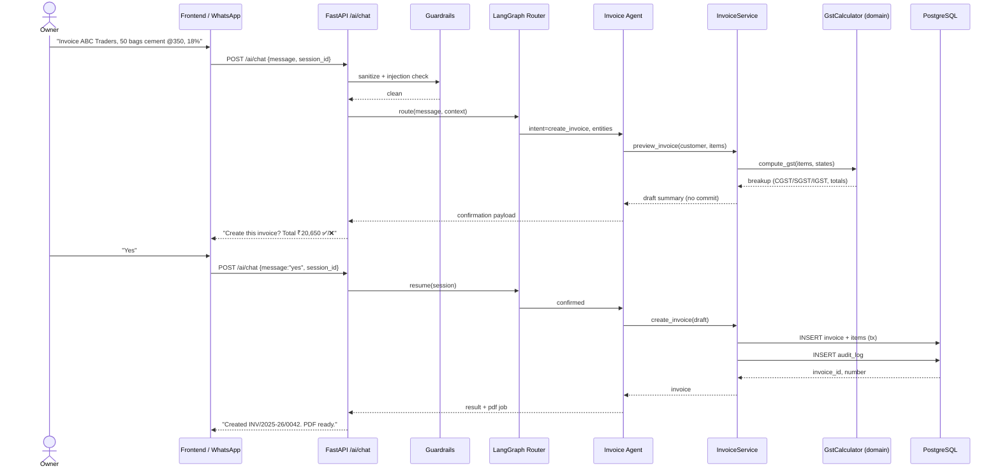
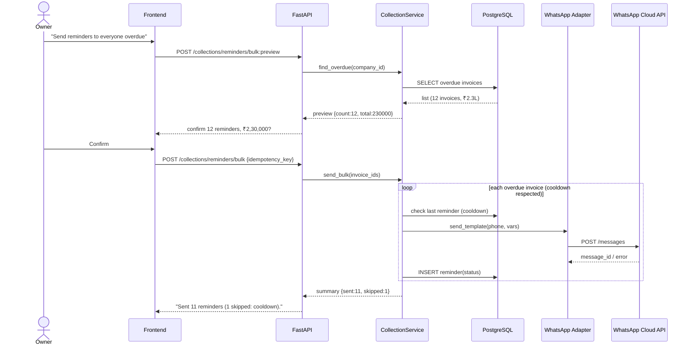
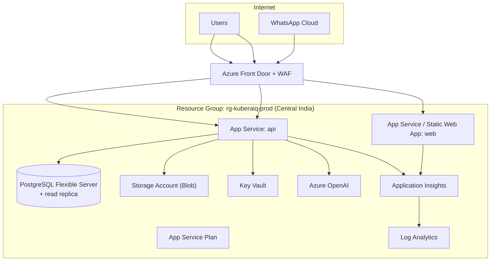

# 5. Architecture & Sequence Diagrams

Architecture style: **Clean Architecture + DDD**, with a clear dependency rule —
dependencies point **inward** (`domain` ← `application` ← `infrastructure`/`interface`).

---

## 5.1 C4 — System context



## 5.2 C4 — Containers



## 5.3 Backend layered architecture (Clean Architecture)



The **dependency rule**: `Domain` imports nothing outward. `Application` defines
**ports** (abstract interfaces); `Infrastructure` provides **adapters** that implement
them. Wiring happens via **dependency injection** in the composition root
(`app/api/deps.py` + `app/core/container.py`).

## 5.4 AI Copilot architecture (LangGraph)



## 5.5 Sequence — Create invoice via AI copilot



## 5.6 Sequence — Bulk WhatsApp reminders (Collections)



## 5.7 Sequence — OIDC login (Entra ID)

```mermaid
sequenceDiagram
    actor U as User
    participant FE as Next.js
    participant ENTRA as Entra ID
    participant API as FastAPI /auth

    U->>FE: Click "Sign in with Microsoft"
    FE->>ENTRA: Authorization request (PKCE)
    ENTRA-->>U: Login + consent
    U->>ENTRA: Credentials
    ENTRA-->>FE: auth code (redirect)
    FE->>API: POST /auth/callback {code, verifier}
    API->>ENTRA: Exchange code → id_token
    ENTRA-->>API: id_token (JWT)
    API->>API: Validate (iss, aud, sig, exp); upsert user
    API-->>FE: app access JWT (15m) + refresh (7d)
    FE->>FE: Store tokens (httpOnly cookie)
```

## 5.8 Deployment topology


