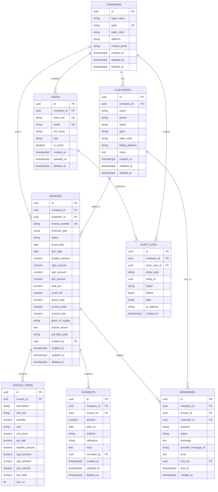

# 6. Database Schema & ER Diagram

**Engine:** PostgreSQL 16. Conventions: `snake_case`, UUID v4 primary keys
(`gen_random_uuid()` via `pgcrypto`), `timestamptz` for all times (stored UTC),
soft-delete via `deleted_at`, and standard audit columns on every business table.

Money is stored as `NUMERIC(14,2)` (paise-precise, never `float`).

---

## 6.1 ER diagram



## 6.2 Design notes

- **Tenant isolation:** every business table carries `company_id`; all repository
  queries filter on it. A future move to Postgres Row-Level Security is supported by
  this column.
- **Invoice numbering:** uniqueness enforced by `UNIQUE(company_id, invoice_number)`.
  Sequence is allocated inside a transaction using a per-company counter row
  (`SELECT ... FOR UPDATE`) to guarantee gap-free numbering per financial year.
- **Money integrity:** `CHECK` constraints keep amounts non-negative and
  `amount_due = grand_total - amount_paid`.
- **Status as enum:** Postgres enums for `invoice_status`, `user_role`,
  `payment_method`, `reminder_channel`, `reminder_status`.
- **Indexes:** foreign keys, plus hot query paths (status + due_date for overdue,
  customer lookups by phone, invoice search by company + issue_date).
- **Audit:** `audit_logs` is append-only (no `updated_at`/`deleted_at`); inserts only.

## 6.3 DDL (authoritative reference — Alembic generates the real migrations)

```sql
CREATE EXTENSION IF NOT EXISTS "pgcrypto";

CREATE TYPE user_role        AS ENUM ('OWNER', 'STAFF', 'VIEWER');
CREATE TYPE invoice_status   AS ENUM ('DRAFT','ISSUED','PARTIALLY_PAID','PAID','OVERDUE','CANCELLED');
CREATE TYPE payment_method   AS ENUM ('CASH','UPI','BANK_TRANSFER','CHEQUE','CARD','OTHER');
CREATE TYPE reminder_channel AS ENUM ('WHATSAPP','SMS','EMAIL');
CREATE TYPE reminder_status  AS ENUM ('PENDING','SENT','FAILED','SKIPPED');

-- COMPANIES -----------------------------------------------------------------
CREATE TABLE companies (
    id             UUID PRIMARY KEY DEFAULT gen_random_uuid(),
    legal_name     VARCHAR(200) NOT NULL,
    gstin          CHAR(15) UNIQUE,
    state_code     CHAR(2)  NOT NULL,
    address        TEXT,
    invoice_prefix VARCHAR(10) NOT NULL DEFAULT 'INV',
    created_at     TIMESTAMPTZ NOT NULL DEFAULT now(),
    updated_at     TIMESTAMPTZ NOT NULL DEFAULT now(),
    deleted_at     TIMESTAMPTZ
);

-- USERS ---------------------------------------------------------------------
CREATE TABLE users (
    id          UUID PRIMARY KEY DEFAULT gen_random_uuid(),
    company_id  UUID NOT NULL REFERENCES companies(id) ON DELETE RESTRICT,
    entra_oid   VARCHAR(64) UNIQUE,
    email       CITEXT NOT NULL,
    full_name   VARCHAR(150),
    role        user_role NOT NULL DEFAULT 'STAFF',
    is_active   BOOLEAN NOT NULL DEFAULT TRUE,
    created_at  TIMESTAMPTZ NOT NULL DEFAULT now(),
    updated_at  TIMESTAMPTZ NOT NULL DEFAULT now(),
    deleted_at  TIMESTAMPTZ,
    CONSTRAINT uq_users_company_email UNIQUE (company_id, email)
);
CREATE INDEX ix_users_company ON users(company_id);

-- CUSTOMERS -----------------------------------------------------------------
CREATE TABLE customers (
    id              UUID PRIMARY KEY DEFAULT gen_random_uuid(),
    company_id      UUID NOT NULL REFERENCES companies(id) ON DELETE RESTRICT,
    name            VARCHAR(200) NOT NULL,
    phone           VARCHAR(20)  NOT NULL,
    email           VARCHAR(200),
    gstin           CHAR(15),
    state_code      CHAR(2),
    billing_address TEXT,
    notes           TEXT,
    created_at      TIMESTAMPTZ NOT NULL DEFAULT now(),
    updated_at      TIMESTAMPTZ NOT NULL DEFAULT now(),
    deleted_at      TIMESTAMPTZ
);
CREATE INDEX ix_customers_company        ON customers(company_id) WHERE deleted_at IS NULL;
CREATE INDEX ix_customers_company_phone  ON customers(company_id, phone);
CREATE INDEX ix_customers_name_trgm      ON customers USING gin (lower(name) gin_trgm_ops);

-- INVOICES ------------------------------------------------------------------
CREATE TABLE invoices (
    id              UUID PRIMARY KEY DEFAULT gen_random_uuid(),
    company_id      UUID NOT NULL REFERENCES companies(id) ON DELETE RESTRICT,
    customer_id     UUID NOT NULL REFERENCES customers(id) ON DELETE RESTRICT,
    invoice_number  VARCHAR(40) NOT NULL,
    financial_year  CHAR(7) NOT NULL,                 -- e.g. 2025-26
    status          invoice_status NOT NULL DEFAULT 'DRAFT',
    issue_date      DATE NOT NULL,
    due_date        DATE NOT NULL,
    taxable_amount  NUMERIC(14,2) NOT NULL DEFAULT 0 CHECK (taxable_amount >= 0),
    cgst_amount     NUMERIC(14,2) NOT NULL DEFAULT 0 CHECK (cgst_amount >= 0),
    sgst_amount     NUMERIC(14,2) NOT NULL DEFAULT 0 CHECK (sgst_amount >= 0),
    igst_amount     NUMERIC(14,2) NOT NULL DEFAULT 0 CHECK (igst_amount >= 0),
    total_tax       NUMERIC(14,2) NOT NULL DEFAULT 0 CHECK (total_tax >= 0),
    round_off       NUMERIC(6,2)  NOT NULL DEFAULT 0,
    grand_total     NUMERIC(14,2) NOT NULL DEFAULT 0 CHECK (grand_total >= 0),
    amount_paid     NUMERIC(14,2) NOT NULL DEFAULT 0 CHECK (amount_paid >= 0),
    amount_due      NUMERIC(14,2) NOT NULL DEFAULT 0 CHECK (amount_due >= 0),
    place_of_supply CHAR(2),
    cancel_reason   TEXT,
    pdf_blob_path   VARCHAR(400),
    created_by      UUID REFERENCES users(id),
    created_at      TIMESTAMPTZ NOT NULL DEFAULT now(),
    updated_at      TIMESTAMPTZ NOT NULL DEFAULT now(),
    deleted_at      TIMESTAMPTZ,
    CONSTRAINT uq_invoice_number UNIQUE (company_id, invoice_number),
    CONSTRAINT ck_due_after_issue CHECK (due_date >= issue_date),
    CONSTRAINT ck_amount_due CHECK (amount_due = grand_total - amount_paid)
);
CREATE INDEX ix_invoices_company_status ON invoices(company_id, status);
CREATE INDEX ix_invoices_overdue        ON invoices(company_id, due_date) WHERE status IN ('ISSUED','PARTIALLY_PAID');
CREATE INDEX ix_invoices_customer       ON invoices(customer_id);
CREATE INDEX ix_invoices_issue_date     ON invoices(company_id, issue_date);

-- INVOICE_ITEMS -------------------------------------------------------------
CREATE TABLE invoice_items (
    id             UUID PRIMARY KEY DEFAULT gen_random_uuid(),
    invoice_id     UUID NOT NULL REFERENCES invoices(id) ON DELETE CASCADE,
    line_no        INT  NOT NULL,
    description    VARCHAR(300) NOT NULL,
    hsn_sac        VARCHAR(10),
    quantity       NUMERIC(12,3) NOT NULL CHECK (quantity > 0),
    unit           VARCHAR(20) NOT NULL DEFAULT 'NOS',
    unit_price     NUMERIC(14,2) NOT NULL CHECK (unit_price >= 0),
    gst_rate       NUMERIC(5,2)  NOT NULL CHECK (gst_rate >= 0 AND gst_rate <= 28),
    taxable_amount NUMERIC(14,2) NOT NULL,
    cgst_amount    NUMERIC(14,2) NOT NULL DEFAULT 0,
    sgst_amount    NUMERIC(14,2) NOT NULL DEFAULT 0,
    igst_amount    NUMERIC(14,2) NOT NULL DEFAULT 0,
    line_total     NUMERIC(14,2) NOT NULL,
    CONSTRAINT uq_invoice_line UNIQUE (invoice_id, line_no)
);
CREATE INDEX ix_invoice_items_invoice ON invoice_items(invoice_id);

-- PAYMENTS ------------------------------------------------------------------
CREATE TABLE payments (
    id          UUID PRIMARY KEY DEFAULT gen_random_uuid(),
    company_id  UUID NOT NULL REFERENCES companies(id) ON DELETE RESTRICT,
    invoice_id  UUID NOT NULL REFERENCES invoices(id) ON DELETE RESTRICT,
    amount      NUMERIC(14,2) NOT NULL CHECK (amount > 0),
    paid_on     DATE NOT NULL,
    method      payment_method NOT NULL DEFAULT 'CASH',
    reference   VARCHAR(120),
    note        TEXT,
    recorded_by UUID REFERENCES users(id),
    created_at  TIMESTAMPTZ NOT NULL DEFAULT now(),
    updated_at  TIMESTAMPTZ NOT NULL DEFAULT now(),
    deleted_at  TIMESTAMPTZ
);
CREATE INDEX ix_payments_invoice ON payments(invoice_id);
CREATE INDEX ix_payments_company ON payments(company_id, paid_on);

-- REMINDERS -----------------------------------------------------------------
CREATE TABLE reminders (
    id                  UUID PRIMARY KEY DEFAULT gen_random_uuid(),
    company_id          UUID NOT NULL REFERENCES companies(id) ON DELETE RESTRICT,
    invoice_id          UUID NOT NULL REFERENCES invoices(id) ON DELETE CASCADE,
    customer_id         UUID NOT NULL REFERENCES customers(id) ON DELETE RESTRICT,
    channel             reminder_channel NOT NULL DEFAULT 'WHATSAPP',
    status              reminder_status  NOT NULL DEFAULT 'PENDING',
    message             TEXT NOT NULL,
    provider_message_id VARCHAR(120),
    error               TEXT,
    sent_by             UUID REFERENCES users(id),
    sent_at             TIMESTAMPTZ,
    created_at          TIMESTAMPTZ NOT NULL DEFAULT now()
);
CREATE INDEX ix_reminders_invoice ON reminders(invoice_id);
CREATE INDEX ix_reminders_company ON reminders(company_id, created_at);

-- AUDIT_LOGS (append-only) --------------------------------------------------
CREATE TABLE audit_logs (
    id            UUID PRIMARY KEY DEFAULT gen_random_uuid(),
    company_id    UUID NOT NULL REFERENCES companies(id) ON DELETE RESTRICT,
    actor_user_id UUID REFERENCES users(id),
    entity_type   VARCHAR(40) NOT NULL,
    entity_id     UUID,
    action        VARCHAR(40) NOT NULL,
    before        JSONB,
    after         JSONB,
    ip_address    INET,
    created_at    TIMESTAMPTZ NOT NULL DEFAULT now()
);
CREATE INDEX ix_audit_company_entity ON audit_logs(company_id, entity_type, entity_id);
CREATE INDEX ix_audit_created ON audit_logs(created_at);

-- Per-company invoice counter (gap-free numbering) --------------------------
CREATE TABLE invoice_counters (
    company_id     UUID NOT NULL REFERENCES companies(id) ON DELETE CASCADE,
    financial_year CHAR(7) NOT NULL,
    last_value     INT NOT NULL DEFAULT 0,
    PRIMARY KEY (company_id, financial_year)
);
```

## 6.4 Aging report (illustrative query)

```sql
SELECT
  CASE
    WHEN now()::date - due_date BETWEEN 0  AND 30 THEN '0-30'
    WHEN now()::date - due_date BETWEEN 31 AND 60 THEN '31-60'
    WHEN now()::date - due_date BETWEEN 61 AND 90 THEN '61-90'
    ELSE '90+'
  END AS bucket,
  COUNT(*)        AS invoices,
  SUM(amount_due) AS outstanding
FROM invoices
WHERE company_id = :company_id
  AND status IN ('ISSUED','PARTIALLY_PAID','OVERDUE')
  AND amount_due > 0
GROUP BY 1
ORDER BY 1;
```
