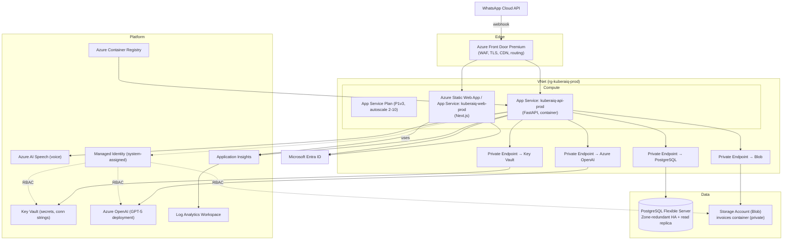

# 11. Azure Architecture

Target region: **Central India** (with **South India** as DR/secondary) for data residency.

## 11.1 Resource topology

## 11.2 Service mapping

| Concern | Azure service | Notes |
| --- | --- | --- |
| Frontend hosting | Static Web Apps (or App Service) | Global CDN, preview envs per PR |
| Backend hosting | App Service (Linux container) | Autoscale on CPU + HTTP queue length |
| Container registry | Azure Container Registry | Images built in CI, scanned (Trivy/Defender) |
| Database | Azure Database for PostgreSQL Flexible Server | Zone-redundant HA, PITR, read replica for reports |
| Object storage | Blob Storage (private + SAS) | Invoice PDFs; lifecycle to cool tier after 90d |
| Secrets | Key Vault | Accessed via Managed Identity; no secrets in app settings |
| Identity | Microsoft Entra ID | OIDC for users; app registration for API |
| AI | Azure OpenAI | GPT-5 deployment; content filters on |
| Voice | Azure AI Speech | STT for voice commands |
| Edge/security | Front Door + WAF | OWASP managed ruleset, rate limiting, TLS |
| Observability | Application Insights + Log Analytics | Traces, metrics, logs, alerts, dashboards |
| Secrets-less auth | Managed Identity | API → KV/Blob/OpenAI via RBAC, no keys |

## 11.3 Networking & security boundaries

- Data services (PostgreSQL, Blob, Key Vault, OpenAI) reachable **only via Private
  Endpoints**; public network access disabled.
- App Service integrated into the VNet (regional VNet integration).
- Front Door is the only public ingress; WAF in Prevention mode.
- TLS 1.2+ end to end; HSTS at the edge.

## 11.4 Environments

| Env | Resource group | Scale | Data |
| --- | --- | --- | --- |
| dev | rg-kuberaiq-dev | 1 instance, basic SKUs | synthetic |
| staging | rg-kuberaiq-stg | 2 instances, prod-like | anonymised |
| production | rg-kuberaiq-prod | autoscale 2-10, HA | live (India region) |

## 11.5 Monitoring strategy

- **Golden signals** per service: latency, traffic, errors, saturation.
- App Insights dashboards: API p50/p95/p99, error rate, dependency health (PG, Blob,
  OpenAI, WhatsApp), LLM tokens & cost per tenant.
- **Alerts** (Action Group → email/Teams/PagerDuty): error rate > 2% (5 min), p95 > SLO,
  DB CPU > 80%, DB connections > 80%, OpenAI/WhatsApp failure spike, available-memory low.
- Synthetic availability tests on `/health/ready` from multiple regions.

## 11.6 Logging strategy

- Structured JSON logs → Log Analytics; correlation by `request_id`, `company_id`.
- Log levels by env (DEBUG in dev, INFO in prod). **No PII/secrets** in logs (redaction filter).
- Retention: 30 days hot in Log Analytics, archived to Blob for 1 year (compliance).
- Audit logs persisted in Postgres (`audit_logs`) **and** mirrored to Log Analytics.

## 11.7 Backup & DR strategy

| Asset | Mechanism | RPO | RTO |
| --- | --- | --- | --- |
| PostgreSQL | Automated backups + PITR (7–35 days), geo-redundant | ≤ 15 min | ≤ 1 h |
| Blob (PDFs) | GRS replication + soft delete + versioning | near-zero | minutes |
| Key Vault | Soft-delete + purge protection | n/a | minutes |
| IaC/config | Versioned in git (Bicep) | n/a | redeploy |

- Quarterly restore drills; documented runbooks.
- DR: secondary region (South India) — geo-restore PostgreSQL, redeploy from IaC + ACR,
  Front Door fail-over to standby origin.

## 11.8 Infrastructure as Code

All infra is defined in **Bicep** under `infra/bicep/` (modules: network, postgres,
storage, keyvault, appservice, openai, monitoring). CI plans/whatifs on PR; CD applies on
merge to `main` (staging) and on tagged release (production), gated by manual approval.
See Doc 12 for the secrets/identity model and Doc 14 for the pipeline.
