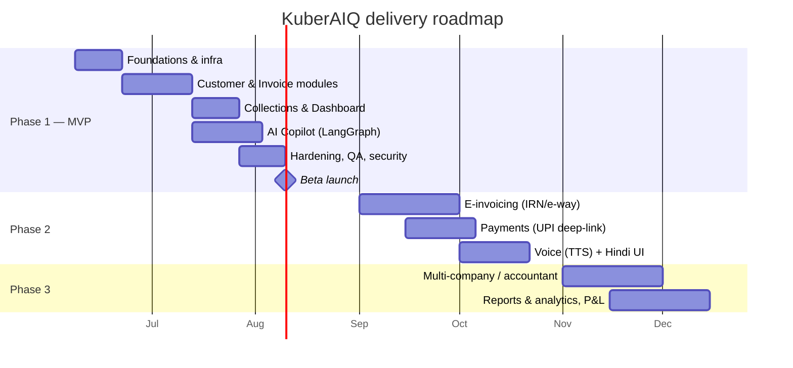
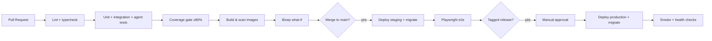

# 14. Development Roadmap

## 14.1 Phasing

## 14.2 Workstreams & milestones

| # | Milestone | Exit criteria |
| --- | --- | --- |
| M0 | **Foundations** | Repo, CI/CD, Docker Compose, DB migrations, auth (Entra + mock), DI container, health checks |
| M1 | **Customers** | Full CRUD + search + history, tests ≥ 80% on service/domain |
| M2 | **Invoices** | Create/edit/cancel/issue, GST engine, numbering, PDF, WhatsApp share |
| M3 | **Payments + Collections** | Payment recording, overdue job, single/bulk reminders, collections dashboard |
| M4 | **Dashboard** | Revenue/pending/overdue/aging/cashflow metrics + charts |
| M5 | **AI Copilot** | Router + 4 agents + tools + guardrails + confirm flow (mock + real LLM) |
| M6 | **Hardening** | Security review, rate limits, observability, load test, DR drill |
| M7 | **Beta** | Deployed to Azure staging→prod, 5 pilot businesses onboarded |

## 14.3 Engineering practices

- Trunk-based with short-lived feature branches; PRs require green CI + 1 review.
- Conventional Commits; semantic version tags trigger production deploy.
- Definition of Done: code + tests (≥80% domain/service) + docs + migration + observability.
- Feature flags for risky/AI features; canary on a subset of tenants.

## 14.4 CI/CD pipeline (overview)

## 14.5 Team & RACI (the 10 roles)

| Activity | PM | AI Arch | Sol Arch | FastAPI | React | Azure | DBA | UX | DevOps | QA |
| --- | --- | --- | --- | --- | --- | --- | --- | --- | --- | --- |
| PRD / scope | **A/R** | C | C | I | I | I | I | C | I | C |
| Architecture | C | C | **A/R** | C | C | C | C | I | C | I |
| DB schema | I | I | C | C | I | I | **A/R** | I | I | C |
| Backend | I | C | C | **A/R** | I | I | C | I | I | C |
| Frontend/UX | C | I | C | I | **A/R** | I | I | **R** | I | C |
| AI agents | C | **A/R** | C | R | I | I | I | I | I | C |
| Azure/infra | I | I | C | I | I | **A/R** | C | I | **R** | I |
| Security | C | C | **A/R** | R | R | R | R | I | R | C |
| CI/CD | I | I | C | C | C | C | I | I | **A/R** | C |
| Testing/QA | C | C | C | R | R | I | I | I | C | **A/R** |

(A=Accountable, R=Responsible, C=Consulted, I=Informed)

## 14.6 Risk burn-down (top 3)

1. **GST correctness** — built first as a pure domain service with exhaustive unit tests.
2. **AI safety** — guardrails + confirm-before-commit shipped with the first agent.
3. **WhatsApp template approval** — submitted in M0 to de-risk the M3 timeline.
